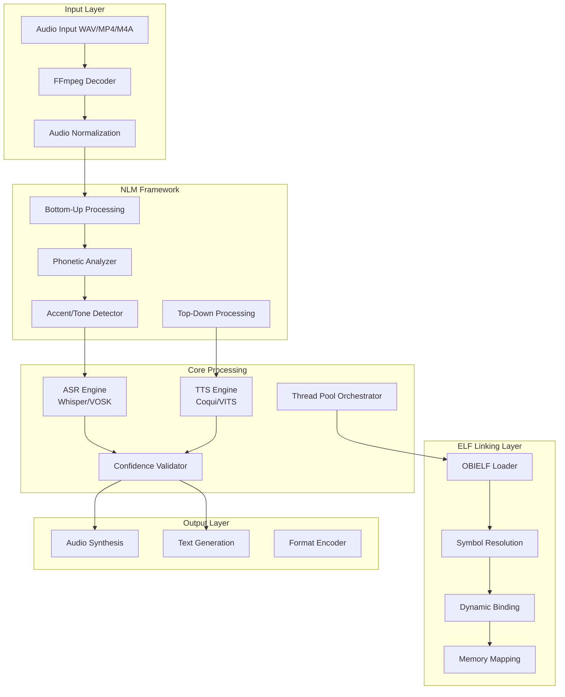

# OBIVox System Architecture & Development Plan

## System Overview
OBIVox is a bidirectional knowledge interface implementing real-time STT (Speech-to-Text) and TTS (Text-to-Speech) with phonetic structure optimization.

## Core Architecture Components

### 1. Codec Conversion Pipeline Architecture



## Implementation Specification

### Phase 1: Core Rust/C Implementation

```rust
// obivox_core.rs - Main system structure
use std::sync::{Arc, Mutex};
use std::collections::HashMap;

pub struct OBIVoxEngine {
    // Core components
    ffmpeg_handler: Arc<FFmpegProcessor>,
    nlm_framework: NLMFramework,
    codec_registry: HashMap<String, Box<dyn CodecHandler>>,
    elf_linker: OBIELFLinker,
}

pub struct NLMFramework {
    bottom_up: BottomUpProcessor,
    top_down: TopDownProcessor,
    phonetic_analyzer: PhoneticAnalyzer,
}

pub struct PhoneticAnalyzer {
    tone_detector: ToneDetector,
    pitch_analyzer: PitchAnalyzer,
    accent_classifier: AccentClassifier,
    // High-level features, not voice-dependent
    prosody_extractor: ProsodyExtractor,
}

pub trait CodecHandler: Send + Sync {
    fn encode(&self, input: &[u8]) -> Result<Vec<u8>, CodecError>;
    fn decode(&self, input: &[u8]) -> Result<Vec<u8>, CodecError>;
    fn get_confidence(&self) -> f32;
}
```

### Phase 2: FFmpeg Integration Layer

```c
// ffmpeg_bridge.c - FFmpeg C bindings
#include <libavformat/avformat.h>
#include <libavcodec/avcodec.h>
#include <libswresample/swresample.h>

typedef struct {
    AVFormatContext *fmt_ctx;
    AVCodecContext *codec_ctx;
    SwrContext *swr_ctx;
    int sample_rate;
    int channels;
} OBIVoxFFmpegContext;

// Initialize FFmpeg pipeline
int obivox_ffmpeg_init(OBIVoxFFmpegContext **ctx, const char *input_path) {
    *ctx = malloc(sizeof(OBIVoxFFmpegContext));
    
    // Open input file
    if (avformat_open_input(&(*ctx)->fmt_ctx, input_path, NULL, NULL) < 0) {
        return OBIVOX_ERR_OPEN_FAILED;
    }
    
    // Find stream info
    if (avformat_find_stream_info((*ctx)->fmt_ctx, NULL) < 0) {
        return OBIVOX_ERR_NO_STREAM;
    }
    
    // Setup resampler for 16kHz mono
    (*ctx)->swr_ctx = swr_alloc_set_opts(NULL,
        AV_CH_LAYOUT_MONO, AV_SAMPLE_FMT_S16, 16000,
        (*ctx)->codec_ctx->channel_layout,
        (*ctx)->codec_ctx->sample_fmt,
        (*ctx)->codec_ctx->sample_rate, 0, NULL);
    
    return OBIVOX_SUCCESS;
}
```

### Phase 3: System SDK & Plugin Architecture

```rust
// plugin_system.rs - Plugin SDK interface
pub trait OBIVoxPlugin {
    fn init(&mut self) -> Result<(), PluginError>;
    fn process(&mut self, input: AudioBuffer) -> Result<AudioBuffer, PluginError>;
    fn get_metadata(&self) -> PluginMetadata;
}

// Platform-specific builders
pub struct PlatformBuilder {
    target_os: TargetOS,
}

impl PlatformBuilder {
    pub fn build_unix(&self) -> Result<Package, BuildError> {
        // Generate .deb/.rpm packages
        self.generate_systemd_service()?;
        self.compile_shared_libraries()?;
        Ok(Package::Unix(UnixPackage::new()))
    }
    
    pub fn build_macos(&self) -> Result<Package, BuildError> {
        // Generate .dmg with code signing
        self.generate_launchd_plist()?;
        self.compile_frameworks()?;
        Ok(Package::MacOS(DMGPackage::new()))
    }
    
    pub fn build_windows(&self) -> Result<Package, BuildError> {
        // Generate .msi installer
        self.generate_service_manifest()?;
        self.compile_dlls()?;
        Ok(Package::Windows(MSIPackage::new()))
    }
}
```

### Phase 4: ELF Linking Layer for Seamless Integration

```c
// obielf_linker.c - Custom ELF linking for codec modules
#include <elf.h>
#include <dlfcn.h>

typedef struct {
    Elf64_Ehdr header;
    void* codec_symbols;
    void* memory_map;
} OBIELFContext;

// Dynamic codec loading with OBIELF format
int obielf_load_codec(const char* codec_path, OBIELFContext** ctx) {
    *ctx = malloc(sizeof(OBIELFContext));
    
    // Load ELF with custom sections
    void* handle = dlopen(codec_path, RTLD_LAZY | RTLD_LOCAL);
    
    // Resolve codec symbols
    (*ctx)->codec_symbols = dlsym(handle, "obivox_codec_table");
    
    // Map shared memory for zero-copy audio passing
    (*ctx)->memory_map = mmap(NULL, AUDIO_BUFFER_SIZE, 
                              PROT_READ | PROT_WRITE,
                              MAP_SHARED | MAP_ANONYMOUS, -1, 0);
    
    return 0;
}
```

## Platform-Specific SDK Integration

### Linux Package (.deb/.rpm)
```bash
# debian/control
Package: obivox
Version: 1.0.0
Architecture: amd64
Depends: libffmpeg4, libasound2
Description: Bidirectional audio-text processing system
```

### macOS Framework (.dmg)
```xml
<!-- Info.plist -->
<key>CFBundleIdentifier</key>
<string>org.obinexus.obivox</string>
<key>LSBackgroundOnly</key>
<true/>
```

### Windows Service (.msi)
```xml
<!-- obivox.wxs -->
<Component Id="OBIVoxService">
    <ServiceInstall Name="OBIVox" 
                    Start="auto" 
                    Type="ownProcess"/>
</Component>
```

## Build System Configuration

```cmake
# CMakeLists.txt
cmake_minimum_required(VERSION 3.16)
project(OBIVox LANGUAGES C CXX)

# Find dependencies
find_package(PkgConfig REQUIRED)
pkg_check_modules(FFMPEG REQUIRED 
    libavformat libavcodec libswresample)

# Core library
add_library(obivox_core SHARED
    src/core/engine.c
    src/codecs/whisper_wrapper.c
    src/codecs/coqui_wrapper.c
    src/nlm/phonetic_analyzer.c
    src/elf/obielf_linker.c
)

# Platform-specific targets
if(UNIX AND NOT APPLE)
    add_custom_target(package_deb
        COMMAND ${CMAKE_COMMAND} -E cmake_echo_color 
                --cyan "Building .deb package"
        COMMAND dpkg-buildpackage -b -uc
    )
elseif(APPLE)
    add_custom_target(package_dmg
        COMMAND ${CMAKE_COMMAND} -E cmake_echo_color 
                --cyan "Building .dmg package"
        COMMAND hdiutil create -volname OBIVox 
                -srcfolder ${CMAKE_BINARY_DIR}/OBIVox.app 
                -ov OBIVox.dmg
    )
elseif(WIN32)
    add_custom_target(package_msi
        COMMAND ${CMAKE_COMMAND} -E cmake_echo_color 
                --cyan "Building .msi installer"
        COMMAND candle.exe obivox.wxs
        COMMAND light.exe -out OBIVox.msi obivox.wixobj
    )
endif()
```

## Command-Line Interface

```bash
# OBIVox CLI Usage
obivox --input lecture.mp4 --mode stt --output transcript.txt
obivox --input book.txt --mode tts --voice en_US --output audiobook.m4a
obivox --pipeline config.yaml --batch lectures/*.mp4

# Plugin management
obivox-plugin install whisper-large
obivox-plugin list
obivox-plugin configure coqui-tts --voice jenny
```

## Development Roadmap

### Milestone 1: Core Implementation (Weeks 1-4)
- [ ] FFmpeg integration layer in C
- [ ] Basic STT/TTS pipeline in Rust
- [ ] Thread-safe task orchestration
- [ ] Confidence validation system

### Milestone 2: NLM Framework (Weeks 5-8)
- [ ] Bottom-up phonetic processing
- [ ] Top-down semantic analysis
- [ ] Tone/pitch/accent detection
- [ ] Prosody extraction

### Milestone 3: Platform SDKs (Weeks 9-12)
- [ ] Linux package generation (.deb/.rpm)
- [ ] macOS framework and .dmg
- [ ] Windows service and .msi
- [ ] Plugin system architecture

### Milestone 4: OBIELF Integration (Weeks 13-16)
- [ ] Custom ELF sections for codecs
- [ ] Dynamic symbol resolution
- [ ] Memory-mapped audio buffers
- [ ] Zero-copy audio pipeline

## Testing Strategy

```rust
#[cfg(test)]
mod tests {
    use super::*;
    
    #[test]
    fn test_bidirectional_conversion() {
        let input = "Hello, OBIVox";
        let audio = text_to_speech(input).unwrap();
        let output = speech_to_text(audio).unwrap();
        assert_eq!(input.to_lowercase(), output.to_lowercase());
    }
    
    #[test]
    fn test_confidence_threshold() {
        let low_quality_audio = generate_noisy_audio();
        let result = process_with_confidence(low_quality_audio);
        assert!(result.confidence < 0.6);
        assert!(result.requires_confirmation);
    }
}
```

## Integration with OBINexus Ecosystem

The OBIVox system integrates seamlessly with:
- **OBIELF**: Custom ELF format for codec modules
- **ObiCall**: Zero-trust module invocation
- **Self-Healing Architecture**: Fault-tolerant audio processing
- **Rift/GOSI toolchain**: Compilation and linking

## Performance Targets

- STT Latency: < 500ms for 10-second audio
- TTS Latency: < 200ms for 100-word text
- Memory Usage: < 512MB resident
- Thread Pool: 4-8 concurrent workers
- Confidence Threshold: > 0.85 for production